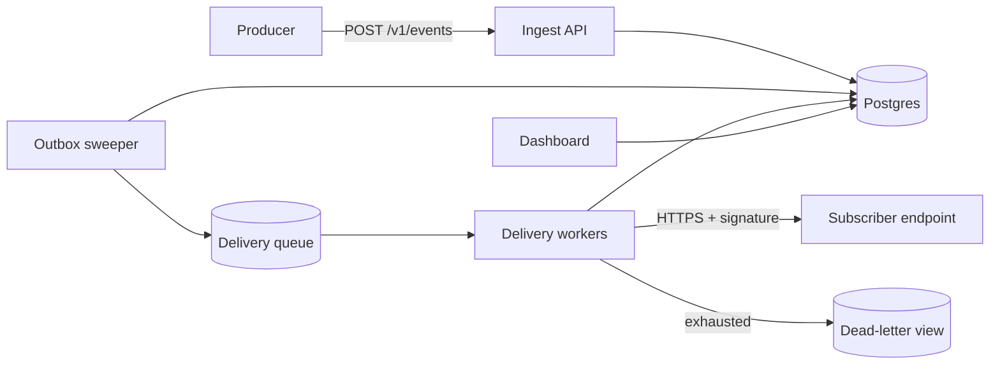

# Relay — Architecture

This document describes how Relay is built: the components on the delivery
path, the data model, and the decisions behind them.

## System overview

Relay is three services around one Postgres cluster and one Redis-backed
queue:

The **ingest API** validates and persists events, then enqueues one delivery
job per matching subscription. **Delivery workers** execute attempts and
write outcomes back. The **dashboard** is a read-mostly UI over the same
store.

## Ingest path

1. Producer calls `POST /v1/events` with an `Idempotency-Key` header.
2. The event row and its delivery rows are written in a single transaction —
   an event is never persisted without its fan-out being durably scheduled.
3. Delivery jobs are enqueued after commit (transactional outbox), so a
   crash between commit and enqueue is healed by the outbox sweeper.

## Delivery path

Workers pull jobs, resolve the subscription's current endpoint and key, and
attempt an HTTPS POST with a 10-second timeout. Outcomes:

- **2xx** — delivery marked `succeeded`.
- **408, 429, 5xx, network error** — delivery marked `retrying` and
  rescheduled per the subscription's retry policy.
- **Other 4xx** — delivery marked `failed` immediately; the endpoint is
  telling us the request itself is unacceptable, so retrying is pointless.

## Data model

Four tables carry the domain; everything else is bookkeeping:

- `events` — immutable payloads, partitioned by publish day.
- `subscriptions` — endpoint, filter, retry policy, signing key reference.
- `deliveries` — one row per (event, subscription), state machine column.
- `attempts` — one row per HTTP attempt, with response code and latency.

## Signing

Signature **v2** signs every delivery with Ed25519 over a canonical string
of timestamp, delivery id, and raw body; the signature and key id travel in
the `Relay-Signature-V2` header. Subscribers verify against the
subscription's public key, fetched once from `GET /v1/keys` and cached —
no shared secret ever leaves Relay.

During migration, deliveries carry both the legacy HMAC header and the v2
header. The v1 HMAC path is scheduled for removal six months after v2
general availability.

Keys remain per-subscription and rotatable with a 24-hour overlap window
during which both old and new keys validate.

## Multi-region posture

Ingest runs active-active in two regions behind latency-based routing.
Delivery workers are region-pinned to their queue. Postgres runs primary in
`us-east` with a warm replica in `eu-west`; regional failover is a runbook
action, not automatic.
