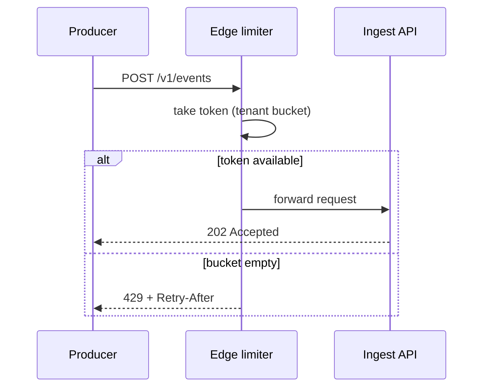

# Relay — Publish Rate Limiting

Design for rate limiting on the publish path. Goal: protect the ingest tier
and fellow tenants from a runaway producer without ever dropping a
well-behaved tenant's events.

## Requirements

- Per-tenant limits, enforced at the edge before any expensive work.
- Burst-friendly: batch publishers legitimately spike 100× for seconds.
- Deterministic feedback: producers must be able to back off correctly from
  the response alone, with no dashboard round-trip.
- Zero false positives during regional failover, when one region absorbs
  both regions' traffic.

## Algorithm

Token bucket per tenant, refilled at the plan's sustained rate with a bucket
sized at 60 seconds of sustained rate. Buckets live in the region-local
Redis; tenants publishing to both regions get a bucket per region sized at
70% each, accepting up to 140% aggregate during split operation.



## Response contract

Limited requests receive `429` with a `Retry-After` header (integer
seconds) and the standard error body:

```json
{
  "error": {
    "code": "rate_limited",
    "message": "publish rate exceeded; retry after 12s",
    "retry_after": 12
  }
}
```

## Plan defaults

| Plan       | Sustained rate | Burst bucket | Batch max |
| ---------- | -------------- | ------------ | --------- |
| Developer  | 10 rps         | 600          | 100       |
| Team       | 100 rps        | 6,000        | 500       |
| Enterprise | custom         | custom       | 2,000     |

## Non-goals

- **No delivery-side limiting here.** Endpoint protection is the existing
  per-endpoint concurrency cap; this design covers publish only.
- **No global coordination.** Cross-region exactness costs more than the
  40% headroom it would save.
